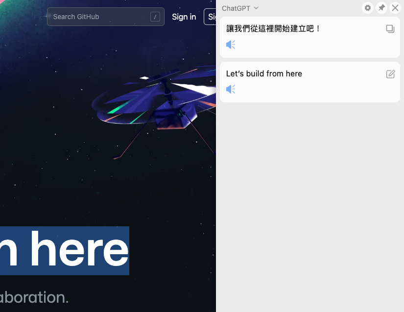
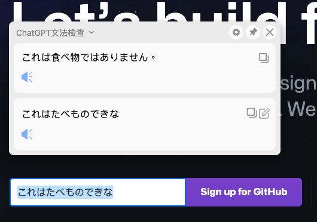
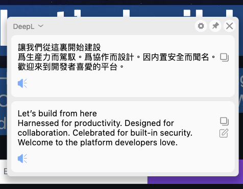

# 側邊翻譯
[](https://github.com/EdgeTranslate/EdgeTranslate/blob/master/LICENSE.MIT)

[](https://github.com/Jakevin/EdgeTranslate/releases)


## 展示


加入ChatGPT 與 ChatGPT文法翻譯器


文法檢查器


DeepL結果繁體化


## 下載

[Release](https://github.com/Jakevin/EdgeTranslate/releases)

**注意：** 火狐瀏覽器附加組件商店裏的版本已不再支持網頁翻譯，需要網頁翻譯的用戶請看[這裏](./wiki/zh_TW/致火狐用戶.md)。

## 手動安裝

從 [GitHub Releases](https://github.com/Jakevin/EdgeTranslate/releases) 下載瀏覽器對應的安裝包 (Chrome 與 QQ 瀏覽器使用相同的安裝包) 。

建議下載最新版本。

### Chrome

-   將下載好的`.zip`安裝包解壓到本地；

-   在瀏覽器中訪問： `chrome://extensions` ；

-   開啓右上角的`開發者模式`；

-   點擊右上角的`加載已解壓的擴展程序`；

-   打開剛纔解壓得到的文件夾，點確定；

### Firefox

-   使用 Firefox 下載`.xapi`文件，下載完成後會自動安裝；

## 構建擴展

構建本擴展需要安裝 [Node.js](https://nodejs.org/) 和 [yarn](https://classic.yarnpkg.com/en/docs/install)。

克隆倉庫：

```shell
git clone https://github.com/Jakevin/EdgeTranslate.git
```

安裝依賴：

```shell
yarn
```

構建 Chrome 和 Firefox 擴展：

```shell
yarn build
```

構建完成之後在 `./packages/EdgeTranslate/build/chrome/` 和 `./packages/EdgeTranslate/build/firefox/` 文件夾下可分別找到 Chrome 擴展和 Firefox 擴展。

## 在瀏覽器中加載已解壓的擴展

### Chrome

-   在瀏覽器中訪問： `chrome://extensions` ；

-   開啓右上角的`開發者模式`；

-   點擊左上角的`加載已解壓的擴展程序`；

-   找到剛才克隆下來的倉庫，打開 `build` 文件夾，選擇其中的 `chrome` 文件夾；

-   現在你就可以在 Chrome 中體驗本擴展了。

### Firefox

-   在瀏覽器中訪問： `about:debugging` ；

-   選中該頁面上的`啓用附加組件調試`；

-   點擊`臨時載入附加組件`；

-   找到剛才克隆下來的倉庫，打開 `build/firefox` , 選擇其中的任意一個文件；

-   現在你就可以在 Firefox 中體驗本擴展了。

## 瞭解更多

[Wiki](./wiki/zh_TW/插件介紹.md)

## 聯係我們

電子郵件: [nickyc975](mailto:chenjinlong2016@outlook.com), [Mark Fenng](mailto:f18846188605@gmail.com)

Telegram 頻道: [側邊翻譯頻道](https://t.me/EdgeTranslate)

QQ 群: [側邊翻譯用戶交流群](https://jq.qq.com/?_wv=1027&k=gT5EYfFB)

加入頻道或群組可以在正式版本發佈前獲得測試包，提前體驗新特性。

## 開源協議

[MIT](../LICENSE.MIT) 與 [NPL](../LICENSE.NPL)

## 貢獻者

<!-- ALL-CONTRIBUTORS-LIST:START - Do not remove or modify this section -->
<!-- prettier-ignore-start -->
<!-- markdownlint-disable -->
<table>
  <tr>
    <td align="center"><a href="https://nickyc975.github.io/"><br /><sub><b>Nicky Chen</b></sub></a><br /><a href="https://github.com/Jakevin/EdgeTranslate/commits?author=nickyc975" title="Code">💻</a> <a href="#data-nickyc975" title="Data">🔣</a> <a href="https://github.com/Jakevin/EdgeTranslate/commits?author=nickyc975" title="Documentation">📖</a> <a href="#ideas-nickyc975" title="Ideas, Planning, & Feedback">🤔</a> <a href="#maintenance-nickyc975" title="Maintenance">🚧</a></td>
    <td align="center"><a href="https://blog.csdn.net/Clark_Fitz817"><br /><sub><b>Lucky Feng</b></sub></a><br /><a href="https://github.com/Jakevin/EdgeTranslate/commits?author=Mark-Fenng" title="Code">💻</a> <a href="#design-Mark-Fenng" title="Design">🎨</a> <a href="#mentoring-Mark-Fenng" title="Mentoring">🧑‍🏫</a> <a href="#ideas-Mark-Fenng" title="Ideas, Planning, & Feedback">🤔</a> <a href="#maintenance-Mark-Fenng" title="Maintenance">🚧</a></td>
    <td align="center"><a href="https://github.com/sansroman"><br /><sub><b>Zia</b></sub></a><br /><a href="https://github.com/Jakevin/EdgeTranslate/commits?author=sansroman" title="Code">💻</a> <a href="#design-sansroman" title="Design">🎨</a> <a href="#ideas-sansroman" title="Ideas, Planning, & Feedback">🤔</a></td>
    <td align="center"><a href="https://www.yang-bo.com/"><br /><sub><b>Yang, Bo</b></sub></a><br /><a href="https://github.com/Jakevin/EdgeTranslate/commits?author=Atry" title="Code">💻</a> <a href="#ideas-Atry" title="Ideas, Planning, & Feedback">🤔</a></td>
    <td align="center"><a href="https://github.com/gdh1995"><br /><sub><b>Dahan Gong</b></sub></a><br /><a href="https://github.com/Jakevin/EdgeTranslate/commits?author=gdh1995" title="Code">💻</a> <a href="#plugin-gdh1995" title="Plugin/utility libraries">🔌</a></td>
  </tr>
  <tr>
    <td align="center"><a href="https://github.com/ViktorOn"><br /><sub><b>Viktor</b></sub></a><br /><a href="#translation-ViktorOn" title="Translation">🌍</a></td>
    <td align="center"><a href="https://github.com/derlans"><br /><sub><b>derlans</b></sub></a><br /><a href="https://github.com/Jakevin/EdgeTranslate/commits?author=derlans" title="Code">💻</a></td>
    <td align="center"><a href="https://github.com/Isildur46"><br /><sub><b>Isildur46</b></sub></a><br /><a href="https://github.com/Jakevin/EdgeTranslate/commits?author=Isildur46" title="Code">💻</a></td>
    <td align="center"><a href="https://ykyuki.net/"><br /><sub><b>ykyuki</b></sub></a><br /><a href="#translation-ykyuki" title="Translation">🌍</a></td>
    <td align="center"><a href="https://github.com/electrolom42"><br /><sub><b>ElectroLom</b></sub></a><br /><a href="#translation-electrolom42" title="Translation">🌍</a></td>
  </tr>
  <tr>
    <td align="center"><a href="https://axionl.me/"><br /><sub><b>ArielAxionL</b></sub></a><br /><a href="https://github.com/Jakevin/EdgeTranslate/commits?author=axionl" title="Documentation">📖</a></td>
    <td align="center"><a href="https://github.com/vanja-san"><br /><sub><b>The_BadUser</b></sub></a><br /><a href="#translation-vanja-san" title="Translation">🌍</a></td>
    <td align="center"><a href="https://github.com/knlyknly"><br /><sub><b>knlyknly</b></sub></a><br /><a href="https://github.com/Jakevin/EdgeTranslate/commits?author=knlyknly" title="Code">💻</a></td>
  </tr>
</table>

<!-- markdownlint-restore -->
<!-- prettier-ignore-end -->

<!-- ALL-CONTRIBUTORS-LIST:END -->

## 幫助本地化

如果你願意幫忙將側邊翻譯翻譯到其他語言，請閱讀下方的指引。

[本地化](./wiki/zh_TW/本地化.md)

## 支持我們

開發側邊翻譯花費了我們許多的時間和精力，如果你真的覺得這個項目對你有幫助，不妨請我們喝罐可樂，支持我們繼續做下去：[PayPal](https://paypal.me/EdgeTranslate)

當然，這 **純屬自願**，打賞并不會帶來什麽優待，不打賞也不會有影響，請量力而爲！
